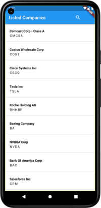

# Basalt Stock Market App

## Description

Basalt Stock Market App is a Flutter application that does shows stock detail for 10 random companies;using [MarketStock APIs](https://marketstack.com/).
The app also uses a date range and an auto complete search box to filter the data from the API.

## Features

- Feature 1: List of Listed company in Stock Market and their details.
- Feature 2: Search Filter on the menu bar .
- Feature 2: Calender picker for date range selection.


## You need the following to run the app
- [Android Studio](https://developer.android.com/studio)
- [Flutter](https://docs.flutter.dev/get-started/install)
- [VS Code](https://code.visualstudio.com/)
- [Dart](https://dart.dev/)
## Installation

1. Clone the repository:
2. Change directory to the project folder:
3. Install dependencies:
4. Run the app:

## Dependencies

List the main dependencies used in your project here:

- provider:
- syncfusion_flutter_datepicker:
- http:
- internet_connection_checker:

##.env
Create .env file in the root to the project and add your MarketStock APIKEY like this:
```bash
API_KEY=YOUR_API_KEY
```

##  App Release
- Open a terminal or command prompt and navigate to your Flutter project's root directory.
- Run the following commands to build the app for release:
```bash
1. flutter clean
2. flutter build apk --release   // For Android
3. flutter build ios --release   // For iOS
```
## Screenshots



